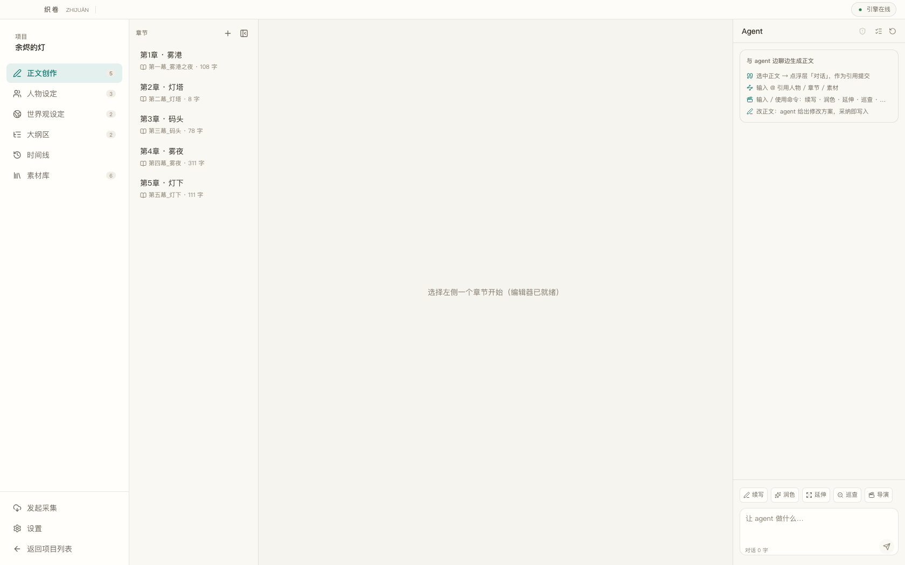
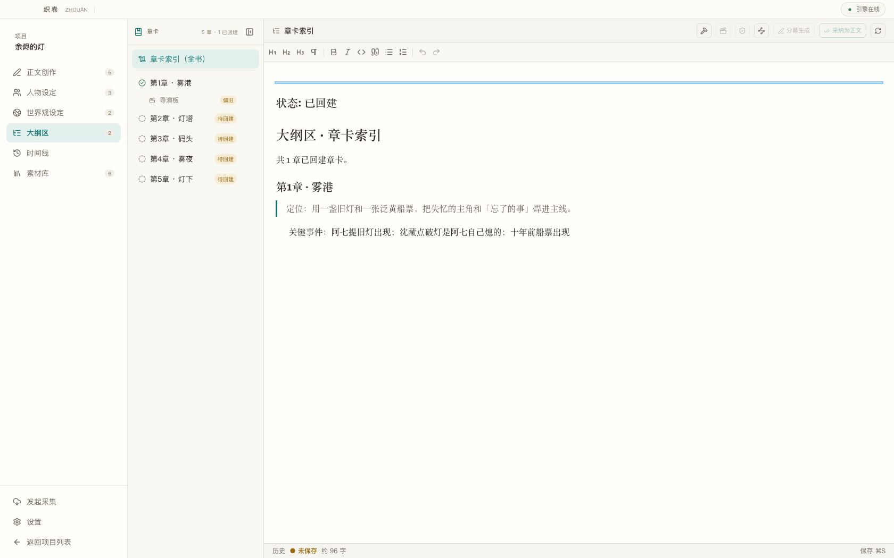
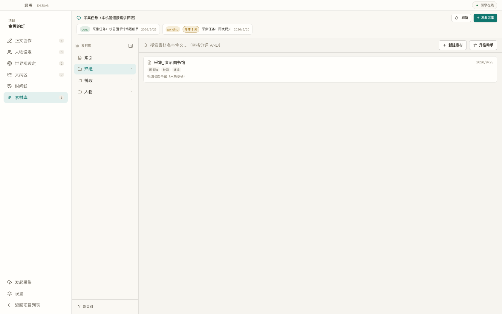
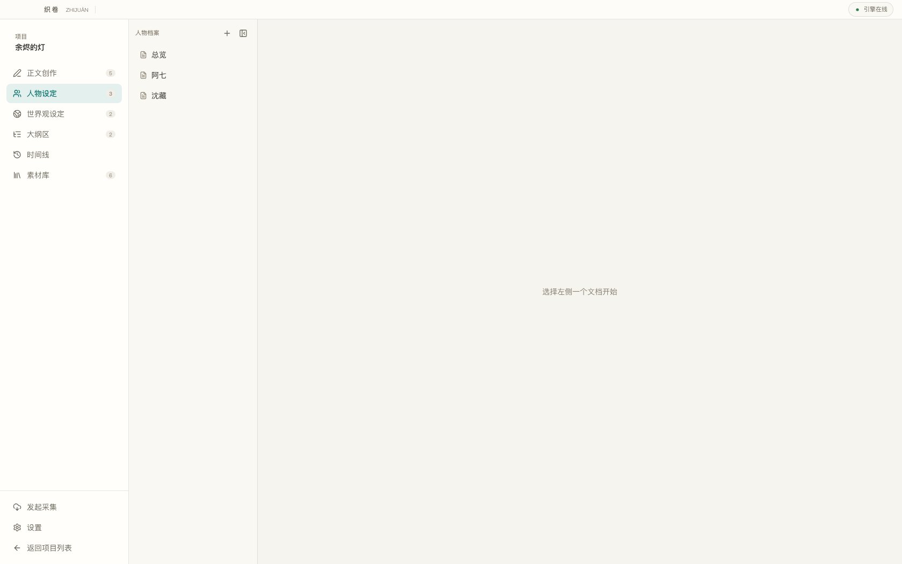
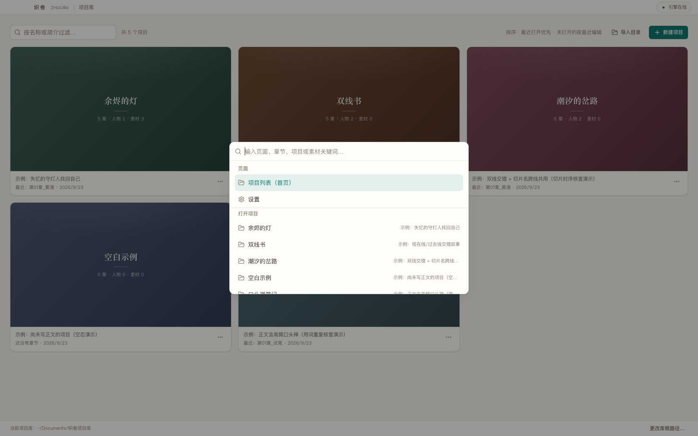

# 织卷 · ZHĪJUǍN

> AI 辅助小说创作工作台 —— 人与 agent 协作、面向**时间切片**的设定推进，支持「先设定后成文」与「先文沉淀设定」双向闭环。

织卷是一款**纯本地优先**的小说写作软件：正文是唯一的源头，设定会随着写作自动演进（**正文为源、设定为流**）。内置的创作 agent 不替你改一个字——所有对设定的修改都走**提案制**，由你确认后才写入；所有正文改动都出**修改卡**，采纳才落笔。

- 数据明文、可入 git，作品永不锁死在工具里
- 模型可接本地 vLLM / 任意 OpenAI 兼容端点，也可切云端厂商
- 无账号、无云同步、无遥测

## 截图

| 项目库 | 正文创作（含 Agent 协作区） |
|---|---|
|  |  |

| 大纲区（章卡 / 导演板） | 素材库 |
|---|---|
|  |  |

| 人物设定 | ⌘K 全局命令面板 |
|---|---|
|  |  |

## 核心特性

**时间切片设定推进**
- 一章一切片：正文约定头（front matter）声明 `切片` 与 `涉及人物`，保存即触发切片同步，自动把本片的事件/状态演进到对应的人物与世界观文档
- 双向闭环：先设定后成文（导演板/素材库供料）与先文沉淀设定（保存自动出提案）都走同一条提案链

**提案制（人对 agent 的护栏）**
- agent 对设定的任何修改都是提案：before 锚点定位 + 过期标记，接受才写入；提案库 `.zhijuan/proposals/` 明文可审计

**Agent 协作区**
- 边聊边生成：右侧对话框直连写作引擎；选中正文 → 引用选中 → 输入指令
- 上下文智能装配：当前章 + 前章尾 + 涉及人物 + 切片设定 + 章卡 + 素材索引，预算硬控
- 工具化 agent：基于写作引擎的织卷域工具（读章节 / 列设定 / 全文搜 / 生成提案 / 一致性巡查），工具调用过程以活动卡形式可见（Todo / Ask / Edit 卡片）

**写作引擎（DeepSeek Harness 边车）**
- dsh 作为独立子进程由 Electron 主进程拉起，织卷自身只做宿主；织卷域能力以 cordis 插件（`src/plugins/zj-core.ts`）注入
- `EnginePort` 适配层：换 agent 框架 = 换一个实现，不动调用方

**创作检查阵容**
- 本章小环：短巡查 / 分层修订（写后即检）
- 全卷审计：一致性巡查、冷读、多视角审视（LLM 层，结论落档 `大纲/审读_*.md`，含「让 agent 改」处置入口）
- 机械层（秒级、零 token、常驻）：人物在场核查、称谓一致性、切片时序核查、人物档案腐坏核查、保存前置名单快检
- 章节导演：动笔前导出导演板——情绪弧分段、每段戏剧任务、波峰定位、人物行为轴、写作红线、钩子（`大纲/<章>_导演.md`）

**批注闭环**
- 划词批注（意图 + 定位 + 原文），批注扫描自动生成修改提案，接受后删行；批注侧标 / 气泡 / 导航抽屉全键盘可达

**写作体验**
- Milkdown/ProseMirror 编辑器，正文满宽、字排按 Apple 排版规范；右键菜单接入写作上下文
- ⌘K 全局命令面板（跨页面/章节/项目直达）
- 暖纸 / 深色两档主题；窄窗口章节列自动折叠保正文可用宽度；本地优先的正文版本历史（`.zhijuan/history/`）、时间线视图、素材库类别树

## 技术栈

Electron · electron-vite · React 19 · TypeScript · Tailwind v4 · shadcn/ui · Milkdown (ProseMirror) · zustand · vitest · DeepSeek Harness（vendored，`install.sh` 拉取）· 无头 Chrome 冒烟（CDP 9224）

## 架构

四层红线（详见 [架构设计-V2](docs/架构设计-V2.md) 与 [模块设计-V2](docs/模块设计-V2.md)）：

| 层 | 职责 | 约束 |
|---|---|---|
| `src/shared` | 纯约定：类型 / front matter / 路径 / provider 适配表 | 无 fs、无 IO，可单测 |
| `src/main` | 域逻辑与文件操作（含 `agent/` 引擎驱动、审计、大纲、档案） | 数据操作只在此层 |
| `src/preload` | 薄桥 | 只转发 IPC |
| `src/renderer` | 页面与交互（editor / agent / outlines / proposals / annotations…） | 不碰文件系统 |

另有 `src/plugins/`（dsh 域插件）与 `dsh-runtime/`（vendored 写作引擎）。

## 快速开始

```bash
# 依赖（npm 镜像见 .npmrc，可按需覆盖）
npm install

# vendored 写作引擎（约 300MB，包含运行时与本地模型支持）
bash dsh-runtime/install.sh

# 开发（Electron + Vite HMR）
npm run dev

# 生产构建 / 预览
npm run build
npm run start

# 测试与检查
npm run typecheck
npm test                 # vitest 单元测试（600+ 用例）
node scripts/serve-renderer.mjs &   # 无头渲染服务
node scripts/xxx-ui-smoke.mjs       # 无头 UI 冒烟（需本机 Chrome CDP 9224）
```

> `scripts/` 下有 100+ 个 UI 冒烟脚本（`*-ui-smoke.mjs`），覆盖编辑器、Agent、审计、批注、命令面板、窄窗、主题等关键路径。

## 目录结构

```
src/            四层源码（shared / main / preload / renderer）
src/plugins/    dsh 域插件（zj-core）
dsh-runtime/    vendored 写作引擎（install.sh 安装，不入库）
docs/           公开设计文档 + docs/screenshots/
scripts/        冒烟脚本与工具（serve-renderer、各 UI smoke）
tests/          单元测试（vitest）
legacy-v1/      V1 原型归档（仅参考）
```

## 主要文档

- [架构设计-V2](docs/架构设计-V2.md)
- [模块设计-V2](docs/模块设计-V2.md)
- [快捷键](docs/快捷键.md)
- [正文写入与切片同步-口径](docs/正文写入与切片同步-口径.md)
- [按钮与状态显示-规范](docs/按钮与状态显示-规范.md)
- [系统菜单-设计口径](docs/系统菜单-设计口径.md)
- [动效分层](docs/动效分层.md)

## License

[MIT](LICENSE) © kk
